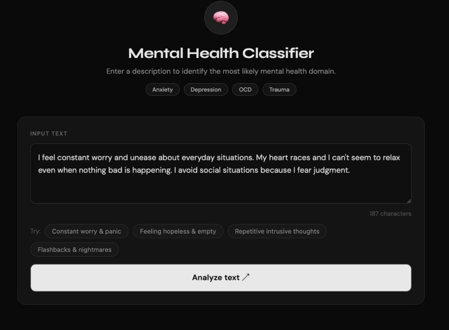
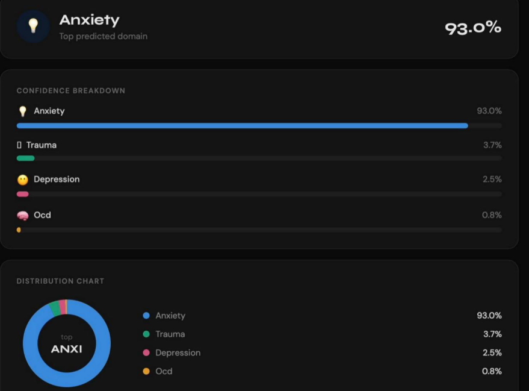
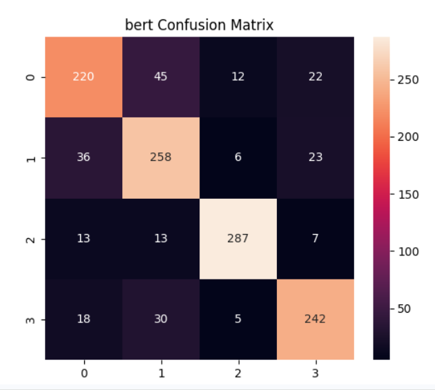
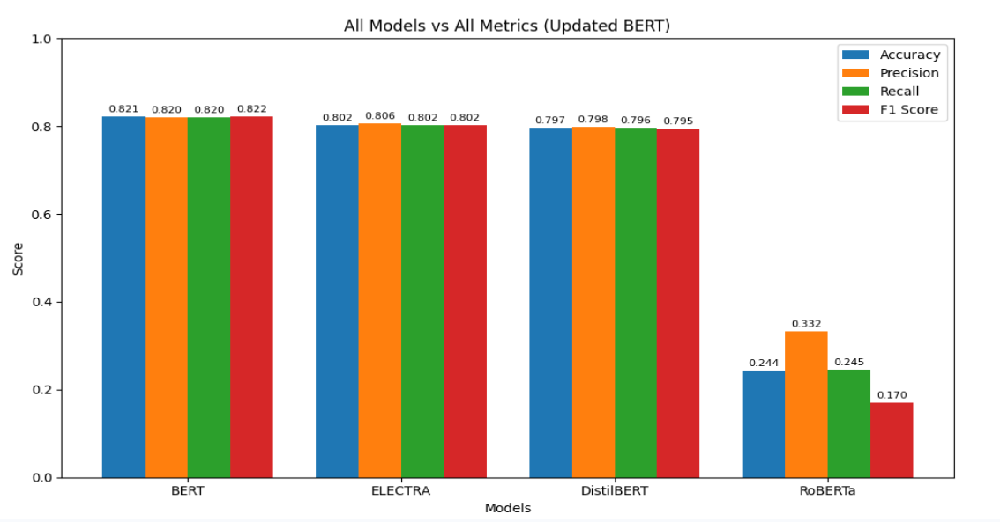

# MindScopeAI – Intelligent Mental Health Domain Classification 🧠✨  

---

## 🌍 Overview  
MindScopeAI is an AI-powered Natural Language Processing (NLP) system designed to automatically classify mental health-related queries into meaningful psychological domains. The system leverages transformer-based deep learning models to understand context, intent, and semantics in textual inputs.

The model categorizes queries into key mental health domains such as Anxiety, Depression, Obsessive/Compulsive Disorders, and Trauma. With the rapid growth of digital mental health discussions, this project provides a scalable and intelligent solution for organizing and analyzing such data.

---

## 🎯 Problem Statement  
Mental health-related textual data is growing rapidly across online platforms, making manual categorization inefficient and inconsistent. Traditional methods struggle to capture contextual nuances in human language.

This project addresses the problem by developing an automated system capable of accurately classifying mental health queries into predefined domains using advanced NLP techniques.

---

## 🚀 Objectives  

- Build an AI-based system for mental health domain classification  
- Utilize large-scale datasets for training and evaluation  
- Apply transformer-based models for contextual understanding  
- Perform effective preprocessing and feature engineering  
- Evaluate performance using multiple metrics  
- Demonstrate AI’s impact in mental health analytics  

---

## 📊 Dataset Description  

### 📁 Data Sources  

- **MHQA (Gold Dataset):** ~2,475 human-annotated samples  
- **MHQA-B (Pseudo Dataset):** ~56,142 automatically labeled samples  

---

### 🧩 Classification Categories  

- Anxiety  
- Depression  
- Obsessive/Compulsive Disorders  
- Trauma  

---

### ⚙️ Preprocessing  

- Text cleaning  
- Lowercasing  
- Tokenization  
- Padding and truncation  
- Encoding  

---

## 🧠 Methodology  

### 🔄 Workflow  

1. Data preprocessing  
2. Tokenization  
3. Model training  
4. Validation  
5. Evaluation  
6. Model selection  

---

### 🤖 Models Evaluated  

- BERT  
- ELECTRA  
- DistilBERT  
- RoBERTa  

**Final Model:** BERT (bert-base-uncased)

---

## ⚙️ Training Configuration  

- Max sequence length: 256  
- Batch size: 16  
- Epochs: 2  
- Learning rate: 2e-5  
- Optimizer: AdamW  
- Loss: Weighted CrossEntropyLoss  

---

## 📈 Evaluation Metrics  

- Accuracy  
- Precision  
- Recall  
- F1 Score  
- ROC-AUC  
- MCC  

---

## 📊 Results  

- **BERT:** ~82% Accuracy & F1 Score  
- ELECTRA & DistilBERT: ~80%  
- RoBERTa: Lower performance  

---

## 📸 Screenshots & Visualizations  

### 🖥️ Application Interface  

---

### 📊 Prediction Output  

---

### 🔍 Confusion Matrix  

---

### 📈 Model Comparison  

---

## 📚 Model Training Notebooks  

- **All Models:**  
https://colab.research.google.com/drive/1P7LLT8fOwyp5qxGd0fGV1s8MdpIZ7tHY?usp=sharing  

- **Final BERT Model:**  
https://colab.research.google.com/drive/1LuemJ6yHI62BHxCYi-cqp4aMY0_cE4Er?usp=sharing  

---

## ▶️ How to Run  

1. Clone the repository  
2. Install dependencies  
3. Download dataset  
4. Run training notebooks  
5. Evaluate results  

---

## 📥 Dataset  

Dataset not included due to size constraints.  

---

## ⚠️ Model Files  

Model weights are not included due to GitHub size limits.

---

## 🔮 Future Work  

- Advanced models (DeBERTa, RoBERTa-large)  
- Multilingual support 🇮🇳  
- Web/mobile deployment  
- Chatbot integration 🤖  
- Explainable AI  

---

## 🏁 Conclusion  

This project demonstrates the effectiveness of transformer-based NLP models in classifying mental health queries with strong accuracy and contextual understanding.

---

## 👩‍💻 Authors  

- Siri Nandini A  
- Pranathi B  
- Geetha A  

---

## ⭐ If you like this project, consider giving it a star!
